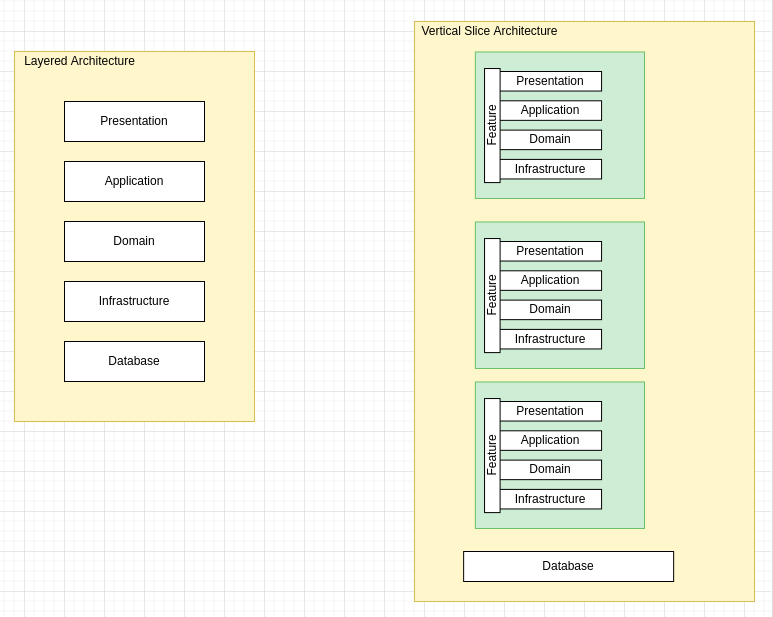

# ASP.NET Core C# Vertical Slice Architecture, CQRS, REST API, DDD, SOLID Principles

About the repoitory:

Open source project written in the latest version of ASP.NET Core, implementing **Vertical Slice Architecture**, S.O.L.I.D. concepts, Clean Code, CQRS (Command Query Responsibility Segregation)

## Give it a star! ⭐

If you liked this project, learned something, give it a star. Thank you!

## **Architecture**

> **What Is Vertical Slice Architecture**
> 
> The vertical slice architecture is a technique that helps us build maintainable applications by separating the application around features or “vertical slices”. 
> 
> In this approach, we think of the application code in terms of features rather than the layer it sits in. We treat each feature as a vertical slice. Because every feature within the application is a separate component, it can change independently. 
> 
> Advantages of Vertical Slice Architecture:
> - Reduction in Coupling
> - External Interaction
> - Command and Query Responsibility Segregation
> - Feature Grouping
>
> -- <cite>https://code-maze.com/vertical-slice-architecture-aspnet-core/</cite>

References:
- https://www.youtube.com/watch?v=L2Wnq0ChAIA
- https://www.youtube.com/watch?v=lsddiYwWaOQ

## **Technologies**

- ASP.NET Core 7.0
- Entity Framework Core 7.0
- Unit & Integration Tests + xUnit + FluentAssertions
- AutoMapper
- FluentValidator
- MediatR
- SQL Server

## License

- [MIT License](https://github.com/jeangatto/ASP.NET-Core-Vertical-Slice-Architecture/blob/main/LICENSE)
