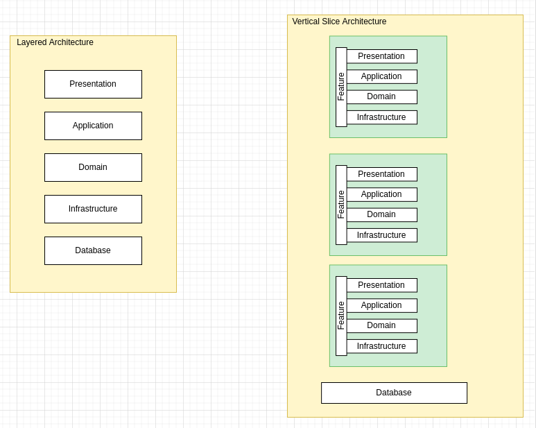

# ASP.NET Core Vertical Slice Architecture with CQRS and REST API

[](https://github.com/jeangatto/ASP.NET-Core-Vertical-Slice-Architecture/actions/workflows/dotnet.yml)
[](https://github.com/jeangatto/ASP.NET-Core-Vertical-Slice-Architecture/actions/workflows/codeql-analysis.yml)
[](https://github.com/jeangatto/ASP.NET-Core-Vertical-Slice-Architecture/actions/workflows/devskim-analysis.yml)
[](LICENSE)

This repository contains a sample blog API built with ASP.NET Core 10 using Vertical Slice Architecture, CQRS, and REST principles. The goal is to show how to keep features self-contained while still applying DDD and SOLID practices in a practical way.

## Give it a star! ⭐

If you found this project useful, consider giving it a star. It helps more than you might think.

## Architecture



Vertical Slice Architecture organizes the application around business features rather than technical layers. Each feature contains the code it needs, including requests, handlers, validators, responses, and related domain models. This makes the system easier to evolve and avoids forcing unrelated concerns into shared layers.

### Design goals

- Vertical Slice Architecture
- CQRS with MediatR
- JWT authentication
- Domain-driven design concepts
- Clean and maintainable code
- Automated tests with xUnit and FluentAssertions

## Project structure

- src/Blog.PublicAPI
  - Data: EF Core context and configuration
  - Domain: aggregates, entities, and business rules
  - Features: feature-based controllers, requests, handlers, and responses
  - Extensions: service registration and infrastructure helpers
- test/Blog.PublicAPI.Tests
  - UnitTests: focused unit tests for helpers and extensions
  - IntegrationTests: end-to-end API validation scenarios

## Prerequisites

- .NET 10 SDK

## Getting started

1. Clone the repository.
2. Restore dependencies:

   ```bash
   dotnet restore
   ```
   
4. Run the API:

   ```bash
   dotnet run --project src/Blog.PublicAPI
   ```
   
6. Open the API documentation in your browser:
   - Scalar: http://localhost:{port}/scalar/v1
   - HTTPS: http://localhost:{port}/scalar/v1

## API overview

The application exposes a small set of endpoints for blog-style scenarios:

- POST /api/auth: authenticate a user and obtain a JWT token
- POST /api/users: create a new user
- POST /api/posts: create a new post (requires authentication)
- GET /api/posts/{id}: retrieve a post by id

## Running tests

Run the full test suite with:

```bash
 dotnet test
```

## Technologies

- ASP.NET Core 10
- Entity Framework Core 10
- SQLite
- MediatR
- FluentValidation
- AutoMapper
- Ardalis.Result
- xUnit, FluentAssertions, and ASP.NET Core MVC Testing

## License

This project is licensed under the [MIT License](LICENSE).
